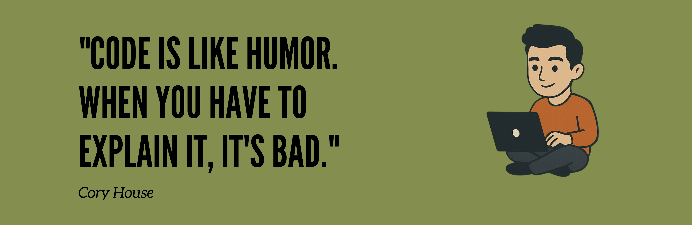

# 
<!-- Add your custom banner image here -->
<div align="center">
  
</div>

<br/>

<div align="center">
  
<!-- Animated subtitle -->
<h3>
  
</h3>

<!-- Animated icons -->
<p>
   
  <em><b>I love connecting ideas and turning them into code!</b></em>
  
</p>

</div>

---

<div align="center">

## 🎯 Quick Overview

</div>

<table align="center">
<tr>
<td width="50%">

### 🙋‍♂️ About Me
- 🔭 Currently working on **[Your Current Project]**
- 🌱 Learning **[Technologies you're learning]**
- 👯 Looking to collaborate on **Open Source Projects**
- 💬 Ask me about **Web Development, AI, or anything tech**
- ⚡ Fun fact: **[Your fun fact]**
- 📫 Reach me: **your.email@example.com**

</td>
<td width="50%">

### 🎨 What I Do
```typescript
interface Developer {
  code: string[];
  focus: string[];
  challenge: string;
}

const me: Developer = {
  code: ["TypeScript", "Python", "Go"],
  focus: ["Web Dev", "AI/ML", "DevOps"],
  challenge: "Building scalable solutions"
}
```

</td>
</tr>
</table>

---

<div align="center">

## 🛠️ My Toolkit

</div>

### 💻 Programming & Markup Languages

<div align="center">


</div>

### 🚀 Frameworks & Libraries

<div align="center">


</div>

### 🗄️ Databases & Cloud

<div align="center">


</div>

### 🔧 Tools & Others

<div align="center">


</div>

---

<div align="center">

## 📊 GitHub Statistics

</div>

<div align="center">
  
  
</div>

<div align="center">
  
  
</div>

---

<div align="center">

## 📈 Contribution Activity

</div>

<div align="center">
  
</div>

---

<div align="center">

## 💭 Random Dev Wisdom

</div>

<div align="center">
  
</div>

---

<div align="center">

## 🤝 Let's Connect!

</div>

<div align="center">

[](https://linkedin.com/in/YOUR_LINKEDIN)
[](https://twitter.com/YOUR_TWITTER)
[](https://YOUR_WEBSITE.com)
[](mailto:your.vedthote33@gmail.com)
[](https://discord.gg/YOUR_DISCORD)

</div>


---

<div align="center">


### ✨ *"Code is poetry written in logic"* ✨

<br/>


[](https://github.com/Ved-Thote)

**Thanks for visiting! ⭐ Star some repositories if you find them interesting!**

</div>

---

<!-- Invisible stats for contribution -->


<!--
**Bonus ASCII for those who read the source!**
╔══════════════════════════════════════╗
║  Thanks for checking out my profile! ║
║          Happy coding! 🚀            ║
╚══════════════════════════════════════╝
-->
